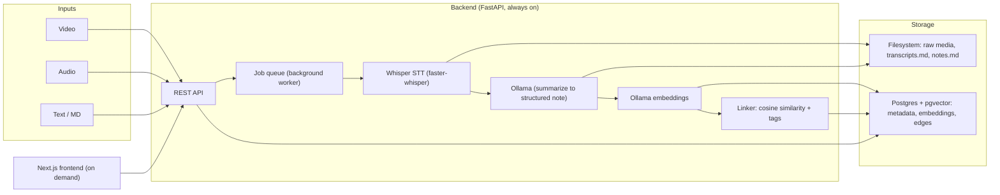

# Zettelkasten

Local-first Zettelkasten: ingest video/audio/text, transcribe it, and turn it into atomic, auto-linked notes — all running on your own machine.

## Architecture



## Key decisions

- **Filesystem is the source of truth** for content (openable in Obsidian); Postgres only holds metadata, embeddings, and edges.
- **One sequential worker** (asyncio) — no Celery, no Redis.
- **Ollama** for both LLM (`qwen2.5:7b`) and embeddings (`nomic-embed-text`).
- **Links** = cosine-similarity edges above a threshold + shared-tag edges, written both to the DB and as `[[wikilinks]]` into the note markdown.

Storage layout:

```text
~/zettelkasten/
  raw/<id>.<ext>          # original media
  transcripts/<id>.md
  notes/<id>.md           # frontmatter: title, tags, source_id, created
```

DB (Postgres + pgvector): `sources`, `notes` (path, title, tags, embedding), `links` (`src_id, dst_id, weight, kind`).

## Repo layout

```text
backend/     FastAPI app, worker pipeline, Dockerfile
front-end/   Next.js + shadcn/radix UI
docker-compose.yml   postgres (pgvector) + ollama + api, restart: unless-stopped
```

## Running the backend

```bash
docker compose up -d --build          # starts db, ollama, api
docker compose exec ollama ollama pull qwen2.5:7b
docker compose exec ollama ollama pull nomic-embed-text
```

API on http://localhost:8000 (docs at `/docs`). See `backend/README.md` for endpoint details.

## Running the frontend

```bash
cd front-end
bun install
bun run dev            # dev mode
bun run build && bun run start   # production, on demand
```

## Pipeline

1. `POST /ingest` saves the file, inserts a `source`, enqueues the job.
2. Video → `ffmpeg -vn` → audio → `faster-whisper` → `transcripts/<id>.md`.
3. Transcript/text → Ollama with a JSON prompt: `{title, summary, key_concepts[], atomic_notes[]}` — each atomic note becomes its own `.md`.
4. Embed each note (`nomic-embed-text`), store in pgvector.
5. Link: cosine KNN above 0.75 + shared tags; append `[[wikilinks]]` to the markdown.
